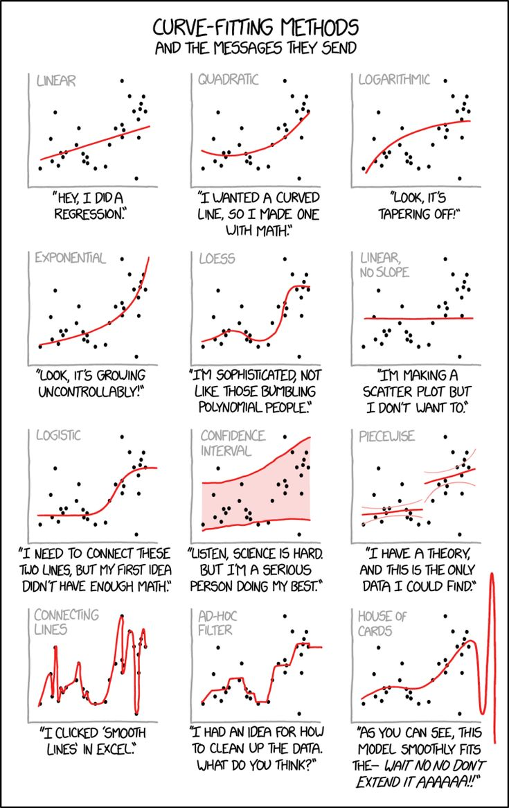

# Columbia Intro to Numerical Methods (APMA E4300)

### Lecture notes
Jupyter notebooks and other lecture materials developed for the Columbia course APMA 4300 by Kyle Mandli. The directory lecture_notes was branched from Kyle Mandli's repo: https://github.com/mandli/intro-numerical-methods.

### Homeworks 
Homeworks completed by Ethan Turok (me) in Fall 2021 when the course was taughy by Marc Spiegelman (Columbia).

### Material
This class covers:
1. Error Analysis
2. Root Finding
3. Interpolation
4. Numerical Differentiation
5. Numerical Integration (Quadrature)
6. Numerical Solutions to ODEs
7. Numerical Methods for Linear Algebra (SVD, QR Factorization)

My experience with this course can be summed up by this:

Source: xkcd comics
